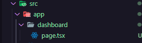
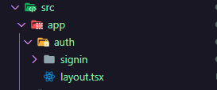
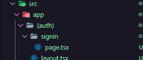
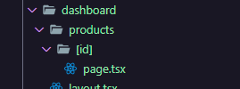

# Next.js 13 Features

### Novo diretório “app”

- Onde devem ser criadas as páginas da aplicação (não mais em “pages”)

- As páginas só serão os arquivos com nome “page.tsx”. Exemplo:
    
    
    
    Página “/dashboard” neste caso
    
- O arquivo “layout.tsx” se assemelha ao arquivo “_page.tsx” da antiga versão, pois só é carregado uma vez na aplicação e não é recarregado na mudança de rota. Basicamente, nesse arquivo deve ser colocado tudo que se deseja compartilhar entre as páginas da aplicação (no caso do “layout.tsx” no primeiro nível dentro de “app”). Só nesse arquivo deve conter as tags que são únicas na aplicação, como html, body.

- É possível ter layout por seção da aplicação. Vamos supor que as páginas de autenticação tem um layout em comum que não é compartilhado com as demais páginas. Nesse caso, a estrutura deve ser assim:
    
    
    
    Basta criar um arquivo “layout.tsx” por seção de páginas. A estrutura do arquivo do layout por seção difere um pouco do layout global, ficando dessa maneira, por exemplo:
    
    ```tsx
    import type { ReactNode } from 'react'
    
    interface AuthLayoutProps {
      children: ReactNode
    }
    
    export default function AuthLayout({ children }: AuthLayoutProps) {
      return (
        <div>
          <h1>Auth Layout</h1>
          {children}
        </div>
      )
    }
    ```
    

- Levemos em consideração a seguinte estrutura:
    
    
    
    Para acessar a página de signIn, a url será a seguinte:
    
    “/auth/signin”
    
    Supondo que não queira ter o “auth” na rota, então basta colocar parênteses no nome da pasta, dessa maneira:
    
    
    
    Agora podemos acessar a mesma página assim “/signin”
    
- A ideia para o arquivo “head.tsx” é semelhante a do arquivo “layout.tsx”: tem um global (no primeiro nível do diretório app) e podemos criar por seção de páginas.

- O arquivo “loading.tsx” será carregado e mostrado em tela quando o Next.js tiver fazendo algum processamento em background para então mostrar o conteúdo da página no lugar do conteúdo do arquivo “loading.tsx”

- Para rotas dinâmicas, a estrutura de pastas deve ser a seguinte:
    
    
    
    E pra pegar as propriedades por rota, a estrutura pra isso deve ser a seguinte:
    
    ```tsx
    interface ProductProps {
      params: {
        id: string
      }
    }
    
    export default function Product({ params }: ProductProps) {
      return <h1>Product: {params.id}</h1>
    }
    ```
    

### Fetch de dados

- Agora nessa versão do Next.js, as requisições podem ser chamadas diretamente dentro do próprio componente, não mais como antes que precisava criar uma função getServerSideProps (SSR), ou getStaticSideProps (SSG), ou com fetch, ou axios, dentro de um useEffect por exemplo. Agora, podemos simplesmente fazer assim:
    
    ```tsx
    import Link from 'next/link'
    
    export default async function Home() {
      const response = await fetch('https://api.github.com/users/jtiagosantos')
      const user = await response.json()
    
      return (
        <div>
          <h1>Home</h1>
          <pre>{JSON.stringify(user, null, 2)}</pre>
          <Link href="/dashboard">Dashboard</Link>
        </div>
      )
    }
    ```
    
    Um ponto importante é que ao fazer dessa maneira, a requisição será Static Site Generation, ou seja, se assemelha ao processo de getStaticSideProps (SSG). Por ser requisição estática, é importante sabermos como tratar o revalidate. Para isso, tem duas maneiras:
    
    **1. revalidate de toda a página**
    
    Bastar exportar uma constante chamada “revalidate” antes do componente:
    
    ```tsx
    import Link from 'next/link'
    
    export const revalidate = 30 //<<<<<<
    
    export default async function Home() {
      const response = await fetch('https://api.github.com/users/jtiagosantos')
      const user = await response.json()
    
      return (
        <div>
          <h1>Home</h1>
          <pre>{JSON.stringify(user, null, 2)}</pre>
          <Link href="/dashboard">Dashboard</Link>
        </div>
      )
    }
    ```
    
    **2. revalidate por requisição**
    
    ```tsx
    import Link from 'next/link'
    
    export default async function Home() {
      const response = await fetch('https://api.github.com/users/jtiagosantos', {
        next: {
          revalidate: 30, //<<<<<<
        },
      })
      const user = await response.json()
    
      return (
        <div>
          <h1>Home</h1>
          <pre>{JSON.stringify(user, null, 2)}</pre>
          <Link href="/dashboard">Dashboard</Link>
        </div>
      )
    }
    ```
    
    Até aqui foi visto para um cenário de SSG. Agora, vamos para SSR:
    
    O objeto, segundo parâmetro da fetch api, aceita também uma propriedade chamada cache. Por padrão, o valor é “force-cache”, o que basicamente diz ao Next.js para forçar o cache da requisição, de modo que o conteúdo ficará estático. Para contornar isso e fazer a requisição a cada acesso, basta passar o valor “no-store” para cache, assim:
    
    ```tsx
    import Link from 'next/link'
    
    export default async function Home() {
      const response = await fetch('https://api.github.com/users/jtiagosantos', {
        cache: 'no-store', //<<<<<<
      })
      const user = await response.json()
    
      return (
        <div>
          <h1>Home</h1>
          <pre>{JSON.stringify(user, null, 2)}</pre>
          <Link href="/dashboard">Dashboard</Link>
        </div>
      )
    }
    ```
    
- Agora é possível implementarmos server components. Isso porque agora podemos fazer as requisições diretamente dentro do componente e pelo lado do servidor, seja com SSG, seja com SSR. Além disso, agora no Next.js 13 todas as requisições aninhadas em um componentes são processadas em paralelo e não mais em cascata como era antes.
    
    Por exemplo:
    
    Primeiro componente:
    
    ```tsx
    export const User = async () => {
      const response = await fetch('https://api.github.com/users/jtiagosantos', {
        cache: 'no-store',
      })
      const user = await response.json()
    
      return (
        <div>
          <h1>User</h1>
          <pre>{JSON.stringify(user, null, 2)}</pre>
        </div>
      )
    }
    ```
    
    Segundo componente:
    
    ```tsx
    export const Repo = async () => {
      const response = await fetch(
        'https://api.github.com/users/jtiagosantos/repos',
        {
          cache: 'no-store',
        },
      )
      const repos = await response.json()
    
      return (
        <div>
          <h1>Repos</h1>
          <pre>{JSON.stringify(repos, null, 2)}</pre>
        </div>
      )
    }
    ```
    

    Usando eles em uma mesma página:

    ```tsx
    import { Repo } from './components/Repo'
    import { User } from './components/User'

    export default async function Home() {
      return (
        <div>
          <h1>Home</h1>
          {/* @ts-expect-error Async Server Component */}
          <User />

          {/* @ts-expect-error Async Server Component */}
          <Repo />
        </div>
      )
    }
    ```

    A chamada nos dois componentes será feita em paralelo.

    A única exceção para o processamento em paralelo é quando a requisição depende do resultado de outra chamada. Nesse caso, as chamadas serão em cascata. No geral, o próprio Next.js fará esse controle.

- Para acessar os cookies e headers diretamente dentro dos componentes, basta importar cookies e headers de “next/headers”, assim:
    
    ```tsx
    import { cookies, headers } from 'next/headers'
    
    export default async function Home() {
      const userCookies = cookies()
      const userHeaders = headers()
    
      return (
        <div>
          {JSON.stringify(userCookies.getAll(), null, 2)}
          {JSON.stringify(userHeaders, null, 2)}
        </div>
      )
    }
    ```
    

### Suspense API

- Nos possibilita colocar loadings em tela por componentes
    
    ```tsx
    import { Repo } from './components/Repo'
    import { User } from './components/User'
    
    export default async function Home() {
      return (
        <div>
          <h1>Home</h1>
          {/* @ts-expect-error Async Server Component */}
          <User />
    
          {/* @ts-expect-error Async Server Component */}
          <Repo />
        </div>
      )
    }
    ```
    
    Por padrão, ao acessar a página do código acima, aparecerá um loading em tela se tiver um arquivo “loading.tsx”, caso contrário, então não aparecerá nenhum loading em tela. Para contornar isso, podemos usar a Suspense API, que aceita uma propriedade fallback, que basicamente será o conteúdo mostrado em tela enquanto o Next.js tiver processando algo em background. Exemplo:
    
     
    
    ```tsx
    import { Suspense } from 'react'
    import { Repo } from '@/components/Repo'
    import { User } from '@/components/User'
    
    export default async function Home() {
      return (
        <div>
          <Suspense
            fallback={
              <>
                <h1>Loading user...</h1>
              </>
            }
          >
            {/* @ts-expect-error Async Server Component */}
            <User />
          </Suspense>
    
          <Suspense
            fallback={
              <>
                <h1>Loading repositories...</h1>
              </>
            }
          >
            {/* @ts-expect-error Async Server Component */}
            <Repo />
          </Suspense>
        </div>
      )
    }
    ```
    
    Agora, ao acessar a página, teremos o seguinte resultado:
    
    
    
    E esse loading é por carregamento de componente, não por tela.
    

### Roteamento de páginas

- Até a versão 12 do Next.js, para fazer redirecionamento dado alguma ação do usuário, usávamos o hook useRouter vindo de “next/router”. Agora no Next.js 13, importamos o mesmo hook de “next/navigation”. Além disso, de “next/navigation” podemos importar outros hooks além do useRouter, como o usePahtname e useSearchParams.

### Client-side components

- Nessa nova versão do, agora temos o controle de hidratação das páginas. Ou seja, agora podemos dizer quais componentes demandam de Javascript vindo do servidor para o client para permitir interatividade do usuário. Para isso, basta colocar um “use client” no início do arquivo do componente para dizer ao [Next.](http://Next.sj)js que hidrate o componente em questão. Exemplo:
    
    ```tsx
    'use client'
    
    import { useState } from 'react'
    
    export const Count = () => {
      const [count, setCount] = useState(0)
    
      return (
        <div>
          <h1>{count}</h1>
          <button onClick={() => setCount((state) => state + 1)}>+</button>
        </div>
      )
    }
    ```
    
    Um ponto importante é que client-side componentes não pode ser assíncronos como os server componentes.